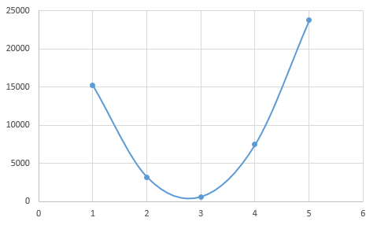

# 論理回路の訓練を行う例

## 概要
[パーセプトロンで論理回路を作成する](../perceptron) 題を通じて、パーセプトロンの仕組みを学びました。  
その例題ではパーセプトロンの内部パラメータである重みとバイアスは人が決めていましたが、 実用的なニューラルネットワーク(ディープラーニング)では、これらのパラメータは数千、数万とあり、人が決めていくことは不可能です。  
しかし、ニューラルネットワークでは、訓練データからパラメータを自動で獲得できる仕組みがあります。  
このパラメータを自動で獲得する仕組みを用いた最適なパラメータを獲得するプロセスをニューラルネットワークの学習と呼びます。  
この例題では、まず層を深くせずに、[パーセプトロンで論理回路を作成する](../perceptron) で扱った論理ゲートで、ニューラルネットワークの学習の理解を深めます。  

この例題を通じて、以下の理解を目指します。  

- ニューラルネットワークの学習とは、パラメータ(重み、バイアス)を最適なものにするプロセスのこと。
- ニューラルネットワークの学習では、損失関数を指標として、その値が最小となるパラメータの獲得を目指す。
- ニューラルネットワークを学習させるためには、初期状態のニューラルネットワークを作成する必要がある。
- 損失関数の値が最小となるパラメータの獲得方法は、損失関数の値の各パラメータに対する勾配を計算し、勾配方向(損失関数の値が小さくなる方向)にそのパラメータを少しずつ更新していく。
- エポック、ミニバッチによる訓練データに対して繰り返しの学習を行い、損失関数の値が最小となるパラメータを獲得する。
- 学習後のニューラルネットワークに対して、未知のデータに対する性能を評価する。

### ニューラルネットワークの作成
ニューラルネットワークの学習を行うにあたり、学習させるニューラルネットワークを作成する必要があります。  
[ニューラルネットワークを設計する](../neural_network)を参照

### ニューラルネットワークへの学習機構の組み込み
作成された直後のニューラルネットワークは、初期化(ランダム、固定値など)された重み、バイアスを持つネットワークになっています。  
このままでは到底有益なニューラルネットワークではないため、重みとバイアスを訓練データから調整する学習を行う必要があります。  
ニューラルネットワークが良くなるようにパラメータを更新するための指標である損失関数とパラメータ更新手法である最適化をニューラルネットワークに組み込む必要があります。  

#### 損失関数
ニューラルネットワークの学習は損失関数の値を手がかりに進みます。  
損失関数が最小となるパラメータを探すために、パラメータの勾配を計算し、その勾配方向(損失関数の値が減る方向)にパラメータの値を少し更新します。  

縦軸が損失関数の値で、横軸があるパラメータ


#### 最適化
ニューラルネットワークの学習の目的は、損失関数をできるだけ小さくするパラメータ(重み、バイアス)を見つけることです。  
そのようなパラメータの見つけ方(手法)を選択する必要があり、KerasにおいてはOptimizerを呼ばれます。  


[最適化手法の可視化](https://github.com/Jaewan-Yun/optimizer-visualization)


### ニューラルネットワークの学習の実施
ニューラルネットワークの学習時には、エポック数、ミニバッチサイズという値を決める必要があります。  
エポック数とは、訓練データをすべて使った学習が行われることを1エポックとよび、エポック数は何度繰り返すかという設定になります。  
ミニバッチサイズとは、1エポック内のすべての訓練データを一度に(バッチ)使わず、サンプルをランダムに選び出して少しずつ学習を進める(ミニバッチ)時のサンプル数になります。  

以下に、学習の全体の流れを擬似コードで示します。  
```python
for エポック数分繰り返す:
    while 訓練データすべてが選ばれるまで繰り返す:
        訓練データの中から、ミニバッチサイズ数のサンプルをランダムに選び出す。
        各重みパラメータに関する損失関数の勾配を求める。
        重みパラメータを勾配方向にすこしだけ更新する。
```

### ニューラルネットワークの評価の実施
ニューラルネットワークの学習を実施しても、そこで終わりではありません。  
訓練したニューラルネットワークが、どの程度の性能をもっているか確認する必要があります。  
また、訓練データに対するで良い性能が出ても、未知のデータに対して同様に良い性能がでるとは限りません。  
訓練データに含まれない、ニューラルネットワークにとっては未知のデータ(テストデータと呼びます)を与えて、ニューラルネットワークの未知のデータに対する性能(汎化性能と呼びます)を確認する必要もあります。  

そのためには、ニューラルネットワークの性能をどのような指標で評価するか決める必要があります。  
ニューラルネットワークが出力した値と正解からこの指標を計算する関数を評価関数と呼びます。  

#### 評価関数
評価関数は、テストデータの正解すべてとテストデータの入力から得られた出力値すべてを受け取り、評価指標を一つ返す関数です。  
以下に、Kerasライブラリから、平均二乗誤差を求める評価関数を示します。  

##### 平均二乗誤差を求める評価関数
```python
def mean_squared_error(y_true, y_pred):
    return K.mean(K.square(y_pred - y_true), axis=-1)
```

評価関数は、回帰問題を評価するものと分類問題を評価するものに大別されます。　　

##### 回帰問題を扱うニューラルネットワークを評価するために使用される評価関数
- Mean Squared Error: mean_squared_error, MSE, mse
- Mean Absolute Error: mean_absolute_error, MAE, mae
- Mean Absolute Percentage Error: mean_absolute_percentage_error, MAPE, mape
- Cosine Proximity: cosine_proximity, cosine

##### 分類問題を扱うニューラルネットワークを評価するために使用される評価関数
- Binary Accuracy: binary_accuracy, acc
- Categorical Accuracy: categorical_accuracy, acc
- Sparse Categorical Accuracy: sparse_categorical_accuracy
- Top k Categorical Accuracy: top_k_categorical_accuracy
- Sparse Top k Categorical Accuracy: sparse_top_k_categorical_accuracy

##### Kerasでは、評価関数を学習機構の組み込み時に指定する必要がある
評価関数は、ニューラルネットワークの性能を評価するための関数であり、学習時には使用されません。  
しかし、Kerasでは、学習機構の組み込み時に評価関数を指定する必要があります。  
原理的には、学習時には不要のため、評価時に指定すればよいはずですが、Kerasではそうなっていません。
Kerasではエポック毎に訓練データと検証用データに対する性能を評価関数で算出して、コンソールに出力しており、そのために学習機構の組み込み時に指定する実装となっているようです。  

```
Train on 1000000 samples, validate on 1000000 samples
Epoch 1/10
1000000/1000000 [==============================] - 1s 1us/step - loss: 0.0054 - acc: 2.0000e-06 - val_loss: 0.9583 - val_acc: 0.0000e+00
Epoch 2/10
1000000/1000000 [==============================] - 1s 1us/step - loss: 2.8114e-06 - acc: 2.0000e-06 - val_loss: 1.0009 - val_acc: 0.0000e+00
Epoch 3/10
1000000/1000000 [==============================] - 1s 1us/step - loss: 1.6842e-09 - acc: 2.0000e-06 - val_loss: 1.0020 - val_acc: 0.0000e+00
Epoch 4/10
1000000/1000000 [==============================] - 1s 1us/step - loss: 1.8891e-12 - acc: 2.0000e-06 - val_loss: 1.0020 - val_acc: 0.0000e+00
Epoch 5/10
```

https://github.com/keras-team/keras/issues/5375


## Q. ADDゲートを実現するニューラルネットワークを作成し、学習してください。

##### 訓練データ、テストデータ
```python
import itertools as it
import numpy as np

# 訓練データ
# (x1, x2)が(0, 0)〜(999, 999)までの100万サンプル
tmp = [x for x in range(0, 1000)]
x_train = np.array(list(it.product(tmp, tmp)))
y_train = np.array(list(map(lambda x: np.add(*x), x_train)))

# テストデータ
# (x1, x2)が(1000, 1000)〜(1999, 1999)までの100万サンプル
tmp = [x for x in range(1000, 2000)]
x_test = np.array(list(it.product(tmp, tmp)))
y_test = np.array(list(map(lambda x: np.add(*x), x_train)))

# データの正規化(0〜1の範囲に変換)
x_train = x_train/y_train.max()
y_train = y_train/y_train.max()
x_test = x_test/y_test.max()
y_test = y_test/y_test.max()
```

http://www.faqs.org/faqs/ai-faq/neural-nets/part1/preamble.html