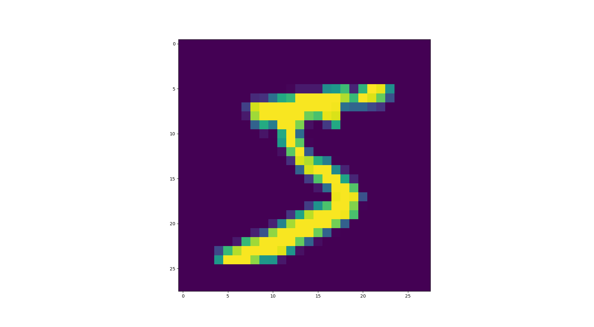

# MNISTデータ・セットで多層パーセプトロンの訓練を行う例

## 概要
0〜9までの数字が1つ手書きされた画像を入力して、そこになんと書いてあるか当てるモデルを作成します。  
具体的には、手書きされた数字を表すグレースケール画像(28ピクセル×28ピクセル)を10個のカテゴリ(0〜9)に分類する多層全結合ニューラルネットワークの作成に取り組みます。  

この例題を通じて、以下の理解を目指します。

- ニューラルネットワークの学習の基本的なワークフローの理解
  - 訓練用、テスト用のデータの準備
  - 訓練用、テスト用のデータの前処理
  - ニューラルネットワークの生成
  - ニューラルネットワークの訓練方法の定義
  - ニューラルネットワークの学習
  - ニューラルネットワークの評価

## データの準備
今回取り組む問題は、教師あり学習です。  
そのため、ニューラルネットワークの学習のために、訓練用の入力データと正解ラベルが必要になります。  

### 訓練用、テスト用のデータの準備
Kerasライブラリでは、組み込みでサンプルデータ・セットが用意されており、そのなかのMNISTという手書き数字の画像セットを使用します。  


このMNISTというデータ・セットは、簡単な実験から論文で用いられる等よく利用されるデータ・セットです。
 　
MNISTのデータ・セットを次のようにして読み込むことができます。  

```python
from keras.datasets import mnist
 
# データ・セットを訓練データ、テストデータに分けて読み込みできる。
(x_train, y_train), (x_test, y_test) = mnist.load_data()
```

x_trainは訓練用の画像データセットであり、y_trainは訓練用の画像データセットに対するラベルセット(1が描かれてる画像に対して、1というラベルが付けられている)。  
x_testはテスト用の画像データセットで、y_testはテスト用画像データセットに対するラベルセットです。  

訓練用とテスト用に分けて読み込む理由は、訓練後にモデルの汎化性能(学習に用いられていない未知のデータに対する分類性能)を確認するためです。  

読み込んだ訓練用の画像データセットはnumpy.ndarrayの形で提供されます。  
```python
type(x_train)
# numpy.ndarray

print(x_train.shape)
# (60000, 28, 28)
```

訓練データ・セットには６万のサンプル画像があり、また、それぞれ28ピクセル×28ピクセルの画像になっています。  
3次元の多重配列の形をとっており、初めの配列は、サンプル画像数に対応して6万個の要素を持っています。
初めの配列の各要素は1つのサンプル画像に対応し、2次元の多重配列(行、列)で画像のピクセルを表現しています。  
このような3次元の多重配列のことを、3次元のテンソルと呼びます。  

これを確認するために、訓練データ・セットの1番目の画像をmatplotlibで可視化してみます。  
```python
from matplotlib import pyplot as plt
plt.imshow(x_train[0])
```



#### Q. 訓練データ・セットの100番目の画像にはどの数字が書かれているでしょうか。

次に、訓練用の画像データセットに対するラベルセットを確認します。  
訓練データ・セットと同じように、numpy.ndarrayの形で提供されます。  

```python
type(y_train)
# numpy.ndarray

print(y_train.shape)
# (60000,)

print(y_train)
# [5 0 4 ... 5 6 8]
```

訓練用の画像データセットに対するラベルセットは、6万のサンプル画像それぞれに対応する正解ラベルであり、各ラベルは0〜9の整数(unit8)で表されます。  
画像とラベルは1対1で対応するため、6万個の要素を持つ1次元の配列で表現されています。  
このような1次元の配列のことを、ベクトルまたは1次元のテンソルと呼びます。

先ほど可視化した訓練データ・セットの1番目の画像のラベルを確認します。  
```python
print(y_train[0])
# 5
```

#### Q. 訓練データ・セットの100番目の画像に書かれた数字の正解はなんですか。

## 訓練用、テスト用のデータの前処理
データを準備しました。
しかし、このままではニューラルネットワークに入力できません。  
ニューラルネットワークに入力するためには、テンソルの形式であること、特徴量が実数であること、欠損値がないことが必要になります。  

このようなデータに対する処理を前処理を呼び、テンソル化、正規化、欠損値処理が含まれます。  

### サンプル画像のテンソル化
先ほど確認したように、入力データはすでに3次元のテンソルになっています。  
テンソル化は必要無いように思いますが、今回学習するニューラルネットワークは全結合ネットワークになります。  
全結合のネットワークとは、各サンプルの入力となる値(特徴量と呼びます)が1次元のテンソルで表現されている必要があります。  

具体的な変換ですが、
各サンプルは、28×28ピクセルが784の要素を持つ配列(1次元のテンソル)で表現されることになります。

```python
x_train = x_train.reshape(60000, 784)
x_test = x_test.reshape(10000, 784)
```

### サンプル画像の各ピクセル値の正規化

訓練データ・セットの各サンプル画像は28×28ピクセルで表現され、各ピクセルは0〜255のグレースケール値をとります。
しかし、このままでは整数のままになり、これを0〜1の範囲に収まる実数に変換処理をします。  
この変換処理を正規化(normalization)と呼びます。  
ニューラルネットワークの学習では、一般的に0〜1の範囲の値になるようにし、複数の種類の異なるデータ

具体的には、float32型でキャストして255で割ることで、0〜1の範囲の浮動小数点に変換します。  

```python
x_train = x_train.astype('float32')
x_test = x_test.astype('float32')
x_train /= 255
x_test /= 255
```

### サンプル画像の各ピクセル値の欠損値処理
MNISTの画像データ・セットは、全サンプル画像について、28×28ピクセルのグレースケール値が全て存在する(欠損値がない)ため、欠損値の処理は必要ありません。  
しかし、欠損値がある場合、２つの方法があります。
- 欠損値が含まれるサンプルを削除する。
- 欠損値を補完する。

欠損値が含まれるサンプルを削除した場合、純粋に学習できるデータ量が減ることになります。  
学習対象のデータ量が潤沢な場合、サンプル数が減っても問題ないですが、サンプル数が少ない場合はもったいないです。  
また、ニューラルネットワークの利用時には、同様に欠損値がある入力を捨てることになります。  
欠損値を補完する場合、一般に、ニューラルネットワークでは、入力データの欠損値を0と補完することが安全です。  
ただし、0が重要な意味を持つときには、注意が必要です。  
もし、MNISTの手書き数字画像に欠損値がある場合、0は背景色のため0で埋めることは妥当そうです。  

#### Q. 訓練データに欠損値が含まれているサンプルがある場合、どうなるでしょうか。

### クラスラベルの前処理


## ニューラルネットワークの生成
ニューラルネットワークに入力できる形

```python
model = Sequential()
model.add(Dense(512, activation='relu', input_shape=(784,)))
model.add(Dropout(0.2))
model.add(Dense(512, activation='relu'))
model.add(Dropout(0.2))
model.add(Dense(num_classes, activation='softmax'))
```

ここでは、層の数や層のサイズなどの選択が必要になります。
これらの設定はネットワークの重みであるパラメータと区別するために、モデルのハイパーパラメータと呼ばれます。


## ニューラルネットワークの訓練方法の定義
```python
model.compile(loss='categorical_crossentropy',
              optimizer=RMSprop(),
              metrics=['accuracy'])
```

### 損失関数

### 最適化

### 評価関数

## ニューラルネットワークの訓練
```python
history = model.fit(x_train, y_train,
                    batch_size=batch_size,
                    epochs=epochs,
                    verbose=1,
                    validation_data=(x_test, y_test))
```

### ミニバッチ学習

### エポック

#### Q．エポック数、ミニバッチ数を変更して学習するとどうなるでしょうか。

### 検証用データ
検証データ・セット
訓練データセット、テストデータ・セット
モデルの評価は、利用可能なデータ・セットを訓練データ・セット、検証データセット、テストデータセットの３つに分割します。
モデルの訓練は訓練データ・セットで行い、モデルの評価は検証データで行います。
モデルの準備が整ったら、最後にテストデータでテストします。
訓練データ・セットとテストデータ・セットの２つで十分と思えますが、モデルの開発で常に設定のチューニングが必要になります。
チューニングでは、モデルの検証データでの性能をフィードバックとして使用します。このチューニングは一種の学習です。つまり、

## ニューラルネットワークの評価
```python
score = model.evaluate(x_test, y_test, verbose=0)
print('Test loss:', score[0])
print('Test accuracy:', score[1])
```

## 参考文献 {-}
[Keras tutorial deep learning in python](https://elitedatascience.com/keras-tutorial-deep-learning-in-python)
