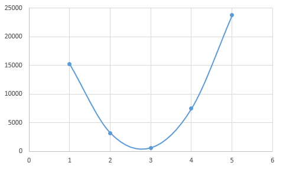

# 論理回路の訓練を行う例

## 概要
[パーセプトロンで論理回路を作成する例](../perceptron) 題を通じて、パーセプトロンの仕組みを学びました。  
パーセプトロンの内部パラメータである、重みとバイアスは人が決めていましたが、ニューラルネットワーク(ディープラーニング)では、これらのパラメータは数千、数万とあり、人が決めていくことは不可能です。  
しかし、ニューラルネットワークでは、訓練データからパラメータを自動で獲得できる仕組みがあります。  
このパラメータを自動で獲得する仕組みを用いた最適なパラメータを獲得するプロセスをニューラルネットワークの学習と呼びます。  
この例題では、層を深くせずに、[パーセプトロンで論理回路を作成する例](../perceptron) で扱った論理ゲートの学習を扱います。  

この例題を通じて、以下の理解を目指します。  

- ニューラルネットワークを学習させるには、初期状態のニューラルネットワークを作成する必要がある。
- 隠れ層の活性化関数としては、なめらかに変化する関数を使用する。
- 出力層の活性化関数としては、多クラス分類問題ならソフトマックス(softmax)、２値分類問題ならなめらかな関数(sigmoid等)、回帰問題なら恒等関数(linear)を用いる。
- ニューラルネットワークの学習とは、パーセプトロンが内包するパラメータ(重み、バイアス)を最適なものにするプロセスのこと。
- ニューラルネットワークの学習のため、損失関数、最適化をニューラルネットワークに組み込む必要がある。
- ニューラルネットワークの学習は、損失関数を指標として、その値が最小となるパラメータの獲得を目指す。
- 損失関数の値が最小となるパラメータの獲得方法は、損失関数の値の勾配を計算し、勾配方向(損失関数の値が小さくなる方向)にパラメータを少しずつ更新していく。
- エポック、ミニバッチによる訓練データに対して繰り返しの学習を行い、損失関数の値が最小となるパラメータを獲得する。
- 学習後のニューラルネットワークに対して、未知のデータに対する性能を評価する。

### ニューラルネットワークの作成
ニューラルネットワークの学習を行うにあたり、学習させるニューラルネットワークを作成する必要があります。  
ニューラルネットワークは、入力層、隠れ層、出力層から構成されます。
[パーセプトロンで論理回路を作成する例](../perceptron)で扱った、XORゲートのネットワーク構造を見てみましょう。  
この図の一番左の列を入力層、中間の列を隠れ層、一番右の列を出力層と呼びます。  
XORゲートのようなネットワーク構造をもつニューラルネットワークは、「2層ネットワーク」と呼ばれます。  
重みやバイアスを持つパーセプトロンから構成される層は隠れ層と出力層のみのため、「2層」と呼ばれます。  

##### XORゲート


ニューラルネットワークを学習するためには、まず、ニューラルネットワークを作成する必要があります。  

#### 入力層
入力層とは、ニューラルネットワークへの入力信号をまとめた層であり、この層では、パーセプトロンは存在しません※。  
※各入力値を１つずつ受ける重みが1、バイアスが1のパーセプトロンをもつ、かつ、加重和をそのまま出力する活性化関数を持つ層と解釈することはできます。  
ニューラルネットワークにおいては、必ず入力層が必要であり、全結合のネットワークの場合その数は必ず１つです。  

入力層においては、入力層における入力数を決める必要がありますが、訓練用データからある程度自動で決まります。  
例えば、論理ゲートでは、入力はx1, x2のみで、入力層における入力の数は２になります。  

##### XOR 真理値表
| x1 | x2 | y |
|----|----|---|
| 0  | 0  | 0 |
| 1  | 0  | 1 |
| 0  | 1  | 1 |
| 1  | 1  | 0 |

#### 隠れ層
隠れ層は、入力層と出力層の中間に位置するパーセプトロンの層です。  
隠れ層においては、隠れ層の数、各隠れ層におけるパーセプトロンの数、各隠れ層における活性化関数を決める必要があります。  
また、入力層と出力層と異なり、複数の隠れ層を設けることができます。

##### 隠れ層の数
隠れ層の数を決めることは難しい問題です。  
殆どの場合、トライアンドエラーを通して良い隠れ層の数を見つける必要があります。  
ただ、一般的には、扱う問題の複雑性に比例して層を増やしていく事になります。  
それは、層を増すほど、ニューラルネットワークの表現力が高まるため、問題の複雑さに対しては層を厚くすることになります。  
しかし、層を増やしていくほど、学習に要する計算量が増え、また、表現力が高まることにより訓練データの特徴を過剰に表現し、汎化性能が低下する過学習を起こしやすくなります。  
また、最適なパラメータを推定する学習過程も難しくなる「勾配消失問題」と呼ばれる問題も出てきます。

##### 隠れ層のパーセプトロンの数
隠れ層のパーセプトロンの数を決めることは難しい問題です。  
殆どの場合、トライアンドエラーを通して良いパーセプトロン数を見つける必要があります。  
ただ、一般的には、少なすぎるパーセプトロン数は、過小学習を招き、訓練データに対する適合も低くなり、汎化性能も低くなります。  
また、多すぎるパーセプトロン数は、過学習を招き、訓練データに対する適合は高いが、汎化性能が低くなってしまいます。  
経験則においては、入力層の入力数と出力層のパーセプトロン数の中間がよいと言われています。  

##### 隠れ層の活性関数の選択
ニューラルネットワークでは、活性化関数に非線形関数を用いる必要があり、線形関数は使用できません。  
非線形関数とは、シグモイド関数やReLu関数のような曲線を含むなめらかな関数のことです。  
線形関数とはy=cxのような直線の関数になります。  

隠れ層において線形関数を使用すると、層を厚くしても、層を厚くする意味がなくなるためです。  
以下のコードでは、線形関数を活性化関数とする2層が1層と同じになることを示しています。  

```python
def linear_c2(x):
    c=2
    y = c*x
    return y

def linear_c4(x):
    c=4
    y = c*x
    return y

weighted_sum = 1
y1 = linear_c2(linear_c2(weighted_sum))
y2 = linear_c4(weighted_sum)

y1 == y2 == 4
```

このように、線形関数を隠れ層の活性化関数とすると、層を厚くするという隠れ層の利点が失われます。  

活性化関数としてどのようなものがあるか、下記を参照してください。  
[An overview of activation functions used in neural networks](https://adl1995.github.io/an-overview-of-activation-functions-used-in-neural-networks.html)

#### 出力層
出力層では、隠れ層からの出力を入力として、ニューラルネットワークの最終的な出力を生み出す層になります。  
出力層においては、出力層におけるパーセプトロンの数、出力層における活性化関数を決める必要があります。  
また、ニューラルネットワークにおいては、必ず出力層が必要であり、全結合のネットワークの場合その数は必ず１つです。  

##### 出力層のパーセプトロンの数と活性化関数の選択
パーセプトロンの数と活性化関数の選択において、ニューラルネットワークが解く問題を意識する必要があります。  
なお、機械学習の問題は、分類問題、回帰問題に大別され、分類問題とは男性、女性を判別するなどであり、回帰問題とは連続的な値を予測する問題です。

出力層のパーセプトロンの数と活性化関数は、問題に応じて決める必要があります。  
多クラス分類問題の場合は、出力層のパーセプトロンの数は分類先(クラスと呼ぶ)の数にし、活性化関数はソフトマックス関数を使用します  
１つのパーセプトロンは１つのクラスに対応し、その出力はそのクラスである確率(0〜1)を意味します。  
例えば、画像を0〜9の数字に分類する場合、パーセプトロンの数は10になります。  
一つの画像に対して、あるパーセプトロンがその画像が0である確率はいくつ、次のパーセプトロンがその画像が1である確率はいくつと出力します。  

2値分類問題の場合は、出力層のパーセプトロンの数は1つで、活性化関数はシグモイド関数などのなめらかな関数を使用します。  
パーセプトロンからの出力値は2値のどちらかになる確率を意味します。  
例えば、男女の2値分類では、パーセプトロンの出力が男性である確率を意味すれば、男性である確率が0の場合に女性であるとも解釈できるためです。  

回帰問題の場合は、出力層のパーセプトロンの数は1つです。  
回帰問題の場合には、活性化関数として恒等関数が使われます。  
恒等関数とは、入力をそのまま出力する関数です。  

[パーセプトロンで論理回路を作成する例](../perceptron)で扱った論理ゲートだと、2値分類問題になります。  
yは0か1の値しかとらず、4つすべての入力パターンを2値に分類する事になります。  
この場合、出力層のパーセプトロンの数は1であり、活性化関数としてシグモイド関数などを利用します。  

##### XOR 真理値表
| x1 | x2 | y |
|----|----|---|
| 0  | 0  | 0 |
| 1  | 0  | 1 |
| 0  | 1  | 1 |
| 1  | 1  | 0 |

### ニューラルネットワークへの学習機構の組み込み
作成された直後のニューラルネットワークは、ランダムな重みと0を設定されたバイアスをもつネットワークになっています。  
このままでは到底有益なニューラルネットワークではないため、重みとバイアスを訓練データから調整する学習を行う必要があります。  
ニューラルネットワークが良くなるようにパラメータを更新するための指標である損失関数とパラメータ更新手法である最適化をニューラルネットワークに組み込む必要があります。  

#### 損失関数
ニューラルネットワークの学習は損失関数の値を手がかりに進みます。  
損失関数が最小となるパラメータを探すために、パラメータの勾配を計算し、その勾配方向(損失関数の値が減る方向)にパラメータの値を少し更新します。  

縦軸が損失関数の値で、横軸があるパーセプトロンの一つの重み


##### ニューラルネットワークでは、ステップ関数を活性化関数として使用できない
ニューラルネットワークを訓練するには、エラー（または損失関数の値）を減らすような方法で入力に対する重みを調整します。  
勾配降下法においては、損失関数の値を減らすために、損失関数の値の勾配を計算し、損失関数が減少する方向にすこしずつ重みを変更していきます。  
ステップ関数は勾配を持たない関数です。  
このステップ関数を活性化関数に使用する層があると、勾配はすべて0になります。  
勾配がすべて0になるため、損失関数を減らすために重みをどの方向に移動させるかは決めることができません。  
これにより勾配をもたないステップ関数では、ニューラルネットワークの訓練ができません。  

#### 最適化
ニューラルネットワークの学習の目的は、損失関数をできるだけ小さくするパラメータ(重み、バイアス)を見つけることです。  
そのようなパラメータの見つけ方(手法)を選択する必要があり、KerasにおいてはOptimizerを呼ばれます。  


[最適化手法の可視化](https://github.com/Jaewan-Yun/optimizer-visualization)


### ニューラルネットワークの学習の実施
ニューラルネットワークの学習時には、エポック数、ミニバッチサイズという値を決める必要があります。  
エポック数とは、訓練データをすべて使った学習が行われることを1エポックとよび、エポック数は何度繰り返すかという設定になります。  
ミニバッチサイズとは、1エポック内のすべての訓練データを一度に(バッチ)使わず、サンプルをランダムに選び出して少しずつ学習を進める(ミニバッチ)時のサンプル数になります。  

以下に、学習の全体の流れを擬似コードで示します。  
```python
for エポック数分繰り返す:
    while 訓練データすべてが選ばれるまで繰り返す:
        訓練データの中から、ミニバッチサイズ数のサンプルをランダムに選び出す。
        各重みパラメータに関する損失関数の勾配を求める。
        重みパラメータを勾配方向にすこしだけ更新する。
```

### ニューラルネットワークの評価の実施
ニューラルネットワークの学習を実施しても、そこで終わりではありません。  
訓練したニューラルネットワークが、どの程度の性能をもっているか確認する必要があります。  
また、訓練データに対するで良い性能が出ても、未知のデータに対して同様に良い性能がでるとは限りません。  
訓練データに含まれない、ニューラルネットワークにとっては未知のデータ(テストデータと呼びます)を与えて、ニューラルネットワークの未知のデータに対する性能(汎化性能と呼びます)を確認する必要もあります。  

そのためには、ニューラルネットワークの性能をどのような指標で評価するか決める必要があります。  
ニューラルネットワークが出力した値と正解からこの指標を計算する関数を評価関数と呼びます。  

#### 評価関数
評価関数は、テストデータの正解すべてとテストデータの入力から得られた出力値すべてを受け取り、評価指標を一つ返す関数です。  
以下に、Kerasライブラリから、平均二乗誤差を求める評価関数を示します。  

##### 平均二乗誤差を求める評価関数
```python
def mean_squared_error(y_true, y_pred):
    return K.mean(K.square(y_pred - y_true), axis=-1)
```

評価関数は、回帰問題を評価するものと分類問題を評価するものに大別されます。　　

##### 回帰問題を扱うニューラルネットワークを評価するために使用される評価関数
- Mean Squared Error: mean_squared_error, MSE, mse
- Mean Absolute Error: mean_absolute_error, MAE, mae
- Mean Absolute Percentage Error: mean_absolute_percentage_error, MAPE, mape
- Cosine Proximity: cosine_proximity, cosine

##### 分類問題を扱うニューラルネットワークを評価するために使用される評価関数
- Binary Accuracy: binary_accuracy, acc
- Categorical Accuracy: categorical_accuracy, acc
- Sparse Categorical Accuracy: sparse_categorical_accuracy
- Top k Categorical Accuracy: top_k_categorical_accuracy
- Sparse Top k Categorical Accuracy: sparse_top_k_categorical_accuracy

##### Kerasでは、評価関数を学習機構の組み込み時に指定する必要がある
評価関数は、ニューラルネットワークの性能を評価するための関数であり、学習時には使用されません。  
しかし、Kerasでは、学習機構の組み込み時に評価関数を指定する必要があります。  
原理的には、学習時には不要のため、評価時に指定すればよいはずですが、Kerasではそうなっていません。
Kerasではエポック毎に訓練データと検証用データに対する性能を評価関数で算出して、コンソールに出力しており、そのために学習機構の組み込み時に指定する実装となっているようです。  

```
Train on 1000000 samples, validate on 1000000 samples
Epoch 1/10
1000000/1000000 [==============================] - 1s 1us/step - loss: 0.0054 - acc: 2.0000e-06 - val_loss: 0.9583 - val_acc: 0.0000e+00
Epoch 2/10
1000000/1000000 [==============================] - 1s 1us/step - loss: 2.8114e-06 - acc: 2.0000e-06 - val_loss: 1.0009 - val_acc: 0.0000e+00
Epoch 3/10
1000000/1000000 [==============================] - 1s 1us/step - loss: 1.6842e-09 - acc: 2.0000e-06 - val_loss: 1.0020 - val_acc: 0.0000e+00
Epoch 4/10
1000000/1000000 [==============================] - 1s 1us/step - loss: 1.8891e-12 - acc: 2.0000e-06 - val_loss: 1.0020 - val_acc: 0.0000e+00
Epoch 5/10
```

https://github.com/keras-team/keras/issues/5375


## Q. ADDゲートを実現するニューラルネットワークを作成し、学習してください。

##### 訓練データ、テストデータ
```python
import itertools as it
import numpy as np

# 訓練データ
# (x1, x2)が(0, 0)〜(999, 999)までの100万サンプル
tmp = [x for x in range(0, 1000)]
x_train = np.array(list(it.product(tmp, tmp)))
y_train = np.array(list(map(lambda x: np.add(*x), x_train)))

# テストデータ
# (x1, x2)が(1000, 1000)〜(1999, 1999)までの100万サンプル
tmp = [x for x in range(1000, 2000)]
x_test = np.array(list(it.product(tmp, tmp)))
y_test = np.array(list(map(lambda x: np.add(*x), x_train)))

# データの正規化(0〜1の範囲に変換)
x_train = x_train/y_train.max()
y_train = y_train/y_train.max()
x_test = x_test/y_test.max()
y_test = y_test/y_test.max()
```

http://www.faqs.org/faqs/ai-faq/neural-nets/part1/preamble.html