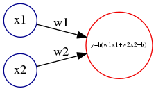
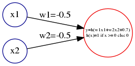
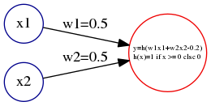
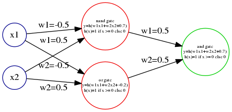

# パーセプトロンで論理回路を作成する例

## 概要
人間の脳は神経細胞(ニューロン)のネットワークで構成されています。  
この最小単位の神経細胞(ニューロン)を模倣したモデル(アルゴリズム)がパーセプトロンとなります。  
パーセプトロンは、ニューラルネットワーク(ディープラーニング)の起源となるアルゴリズムです。  
このパーセプトロンを発展させていったものが、ニューラルネットワーク(ディープラーニング)になります。  
パーセプトロンを用いて、演算処理を実装する例題を通じて、パーセプトロンの仕組みを学びます。  

この例題を通じて、以下の理解を目指します。

- パーセプトロンは入力と出力を備える関数。
- パーセプトロンは関数内に重みとバイアスをパラメータとして持つ。
- パーセプトロンでは、重みとバイアスは人が決める必要がある。
- パーセプトロンを多層化することで、単一のパーセプトロンでは解けない問題を解ける。

## パーセプトロン
パーセプトロンとは、複数の入力を受け取り、1つの出力を出すアルゴリズムであり、そのアルゴリズムは関数として実装することができます。  
数式で表現すると以下のようになります。  


わかりにくいので、下記に、２つの入力を持つパーセプトロンを図と擬似コードで表現してみます。  



```python
def perceptron(x1, x2):
    ### 内部パラメータ
    w1 # x1に対する重み
    w2 # x2に対する重み
    bias # バイアス
    activation # 活性化関数

    ### 演算処理
    weighted_sum = w1*x1 + w2*x2 # 加重和の計算
    return activation(weighted_sum + bias)
```

パーセプトロンでは、入力に対する重みを内部で保持しており、各入力に重みを掛けて合計した加重和を計算します。  
その加重和に内部で保持しているバイアスを足した値を、出力を生み出す関数に入力し、出力を得ます。  
このような出力を生み出す関数を活性化関数と呼びます。  
内部パラメータである、重みとバイアス、活性化関数を調整することで、多様な演算処理を実現することができます。  
パーセプトロンを用いた論理演算の実装を見ていきましょう。  

## パーセプトロンによる論理演算ゲート
論理演算ゲートとは、AND, NAND, OR, XORなどの論理演算を実現する関数です。  
どれも２つの入力を受け取り、出力は真か偽のどちらかです。  
これをパーセプトロンで実現するために、重み、バイアス、活性化関数を調整することになります。  
活性化関数について言えば、真か偽のどちらかを出力する関数を活性化関数として用いる必要があります。  
また、パーセプトロンでは、加重和を計算するため、入力を実数とする必要があるため、ここでは、真を1と偽を0と表現します。  

### パーセプトロンによるANDゲート
パーセプトロンによるANDゲートの実装を見てみます。  
ANDゲートとは、下記の入力、出力仕様を実現する関数です。  

#### AND 真理値表
| x1 | x2 | y |
|----|----|---|
| 0  | 0  | 0 |
| 1  | 0  | 0 |
| 0  | 1  | 0 |
| 1  | 1  | 1 |

ANDゲートは、２つの入力を受け付けます。  
また、ANDゲートの出力は0か1のどちらかです。  

先ほどみたパーセプトロンのアルゴリズムの内部パラメータである、重みとバイアス、活性化関数を下記にすることでANDゲートを実現できます。

```
x1に対する重み： 0.5
x2に対する重み： 0.5
バイアス： -0.7
活性化関数：ステップ関数
```

#### ANDゲートの図とpython実装


```python
def AND(x1, x2):
    ### 内部パラメータ
    w1 = 0.5 # x1に対する重み
    w2 = 0.5 # x2に対する重み
    bias = -0.7 # バイアス
    def step(x): # ステップ関数
        return 1 if x>0 else 0
    activation = step # 活性化関数にステップ関数を使う

    ### 演算処理
    weighted_sum = w1*x1 + w2*x2 # 加重和の計算
    return activation(weighted_sum + bias)
```

### パーセプトロンによるNANDゲート
パーセプトロンによるNANDゲートの実装を見てみます。  
NANDゲートとは、下記の入力、出力仕様を実現する関数です。  

#### NAND 真理値表
| x1 | x2 | y |
|----|----|---|
| 0  | 0  | 0 |
| 1  | 0  | 0 |
| 0  | 1  | 0 |
| 1  | 1  | 1 |

NANDゲートは、２つの入力を受け付けます。  
また、NANDゲートの出力は0か1のどちらかです。  

先ほどみたパーセプトロンのアルゴリズムの内部パラメータである、重みとバイアス、活性化関数を下記にすることでNANDゲートを実現できます。

```
x1に対する重み： -0.5
x2に対する重み： -0.5
バイアス： 0.7
活性化関数：ステップ関数
```

#### NANDゲートの図とpython実装



```python
def NAND(x1, x2):
    ### 内部パラメータ
    w1 = -0.5 # x1に対する重み
    w2 = -0.5 # x2に対する重み
    bias = 0.7 # バイアス
    def step(x): # ステップ関数
        return 1 if x>0 else 0
    activation = step # 活性化関数にステップ関数を使う

    ### 演算処理
    weighted_sum = w1*x1 + w2*x2 # 加重和の計算
    return activation(weighted_sum + bias)
```

### パーセプトロンによるORゲート
パーセプトロンによるORゲートの実装を見てみます。  
ORゲートとは、下記の入力、出力仕様を実現する関数です。  

#### OR 真理値表
| x1 | x2 | y |
|----|----|---|
| 0  | 0  | 0 |
| 1  | 0  | 0 |
| 0  | 1  | 0 |
| 1  | 1  | 1 |

ORゲートは、２つの入力を受け付けます。  
また、ORゲートの出力は0か1のどちらかです。  

先ほどみたパーセプトロンのアルゴリズムの内部パラメータである、重みとバイアス、活性化関数を下記にすることでORゲートを実現できます。

```
x1に対する重み： 0.5
x2に対する重み： 0.5
バイアス： -0.2
活性化関数：ステップ関数
```

#### ORゲートの図とpython実装


```python
def OR(x1, x2):
    ### 内部パラメータ
    w1 = 0.5 # x1に対する重み
    w2 = 0.5 # x2に対する重み
    bias = -0.2 # バイアス
    def step(x): # ステップ関数
        return 1 if x>0 else 0
    activation = step # 活性化関数にステップ関数を使う

    ### 演算処理
    weighted_sum = w1*x1 + w2*x2 # 加重和の計算
    return activation(weighted_sum + bias)
```

### 多層パーセプトロンによるXORゲート
パーセプトロンでは、XORは実装できません。  
正確に言うと、単一のパーセプトロンだけでは実現できません。  
複数のパーセプトロンを組み合わせて、表現することができます。  

パーセプトロンによるXORゲートの実装を見てみます。  
XORゲートとは、下記の入力、出力仕様を実現する関数です。  

#### XOR 真理値表
| x1 | x2 | y |
|----|----|---|
| 0  | 0  | 0 |
| 1  | 0  | 1 |
| 0  | 1  | 1 |
| 1  | 1  | 0 |

XORゲートは、２つの入力を受け付けます。  
また、XORゲートの出力は0か1のどちらかです。  

先ほどみたパーセプトロンのアルゴリズムの内部パラメータである、重みとバイアス、活性化関数を下記にすることでORゲートを実現できます。

#### XORゲートの図とpython実装


```python
def XOR(x1, x2):
    return AND(NAND(x1, x2), OR(x1, x2))
```

## Q. パーセプトロンによるADDとMINUSゲートを実装してください。

## 参考
- [Perceptron: The Artificial Neuron](https://towardsdatascience.com/perceptron-the-artificial-neuron-4d8c70d5cc8d)