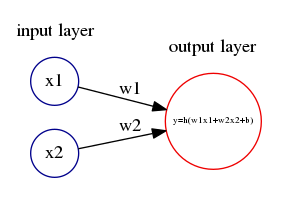
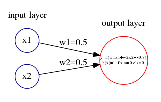
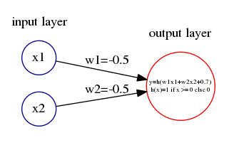
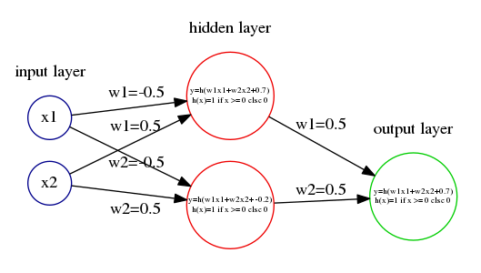

# パーセプトロンで論理回路を作成する例

## 概要

この例題を通じて、以下の理解を目指します。

- パーセプトロンは入力と出力を備えるただの関数。
- パーセプトロンは重みとバイアスを内部のパラメータとして持つ。
- パーセプトロンを組み合わせることで、あらゆる計算ができる。


## 単純パーセプトロン



### 単純パーセプトロンによるANDゲート


```python
def AND(x1, x2):
    def step(x):
        return 1 if x>0 else 0
    return step(0.5*x1 + 0.5*x2 + -0.7)
```

### 単純パーセプトロンによるNANDゲート


```python
def NAND(x1, x2):
    def step(x):
        return 1 if x>0 else 0
    return step(-0.5*x1 + -0.5*x2 + 0.7)
```

### 単純パーセプトロンによるORゲート


```python
def OR(x1, x2):
    def step(x):
        return 1 if x>0 else 0
    return step(0.5*x1 + 0.5*x2 + -0.2)
```

## 多層パーセプトロン

### 多層パーセプトロンによるXORゲート


```python
def XOR(x1, x2):
    return AND(NAND(x1, x2), OR(x1, x2))
```